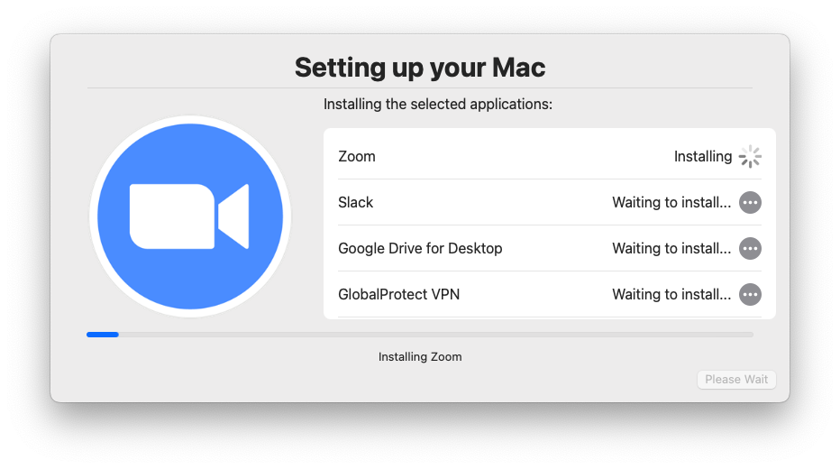
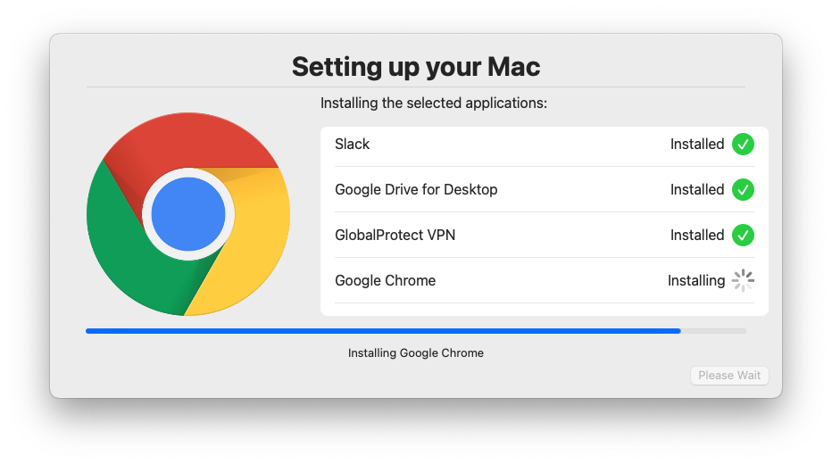
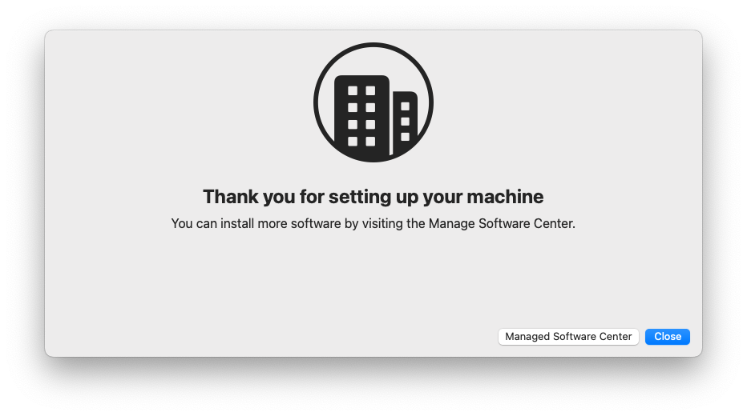

# depnotify-swiftdialog

DEPnotify type workflow with optional software selection. To be triggered during InstallApplications after munki has been installed and setup.

## Welcome

## Required Software Install

## Optional Software

## Final

