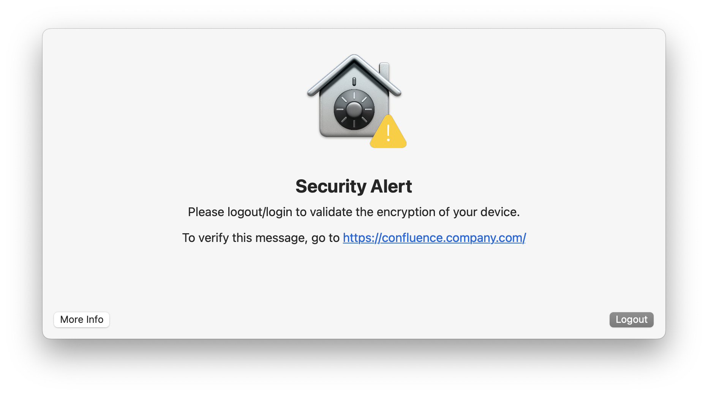

# fv_alert-swiftdialog

Alert that will trigger when Crypt detects an issue with key escrow.

The alerts differ depeding on if the user has a secure token.

## User has a secure token

The user likely simply needs to log out and back in.

## User has no secure token

If this is the case, a member of IT Ops will need to grant the user the secure token.

