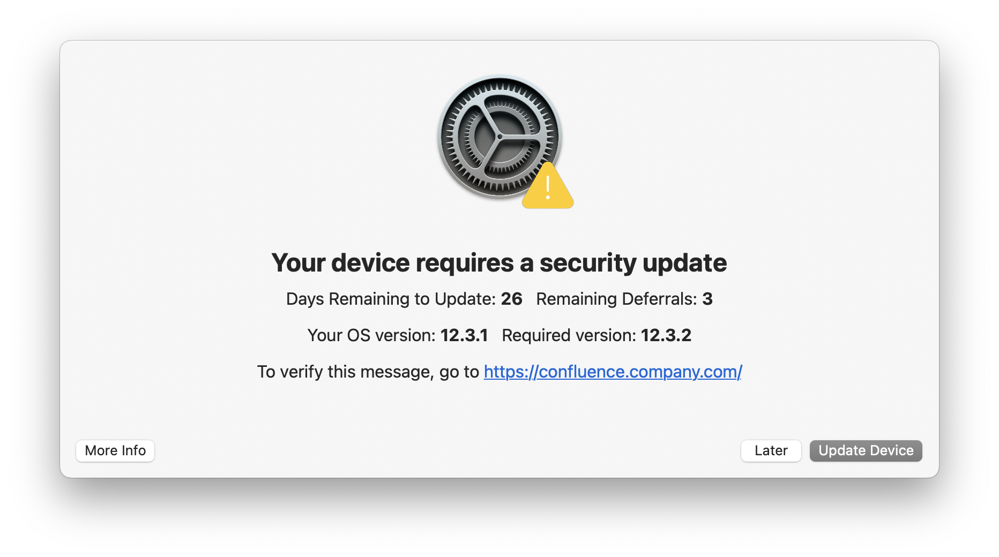
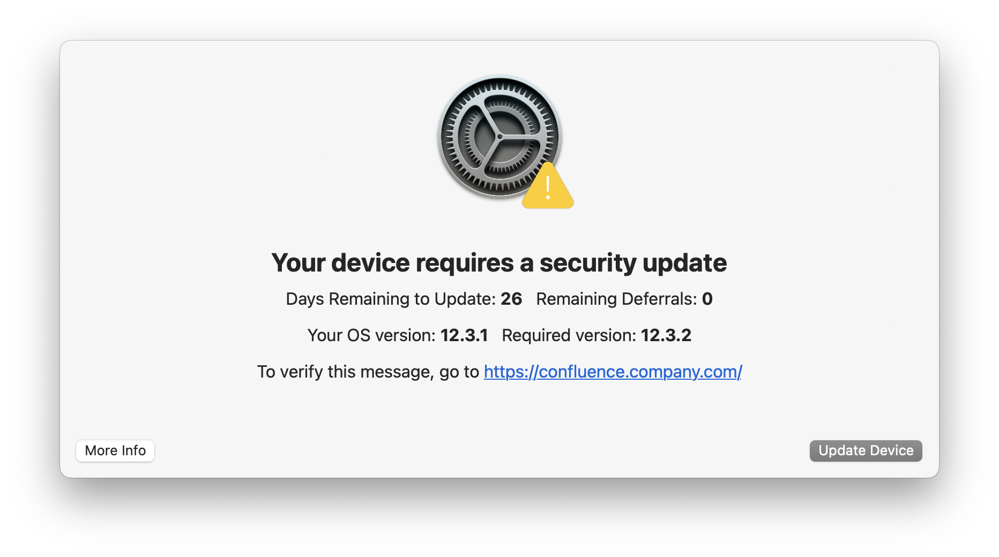
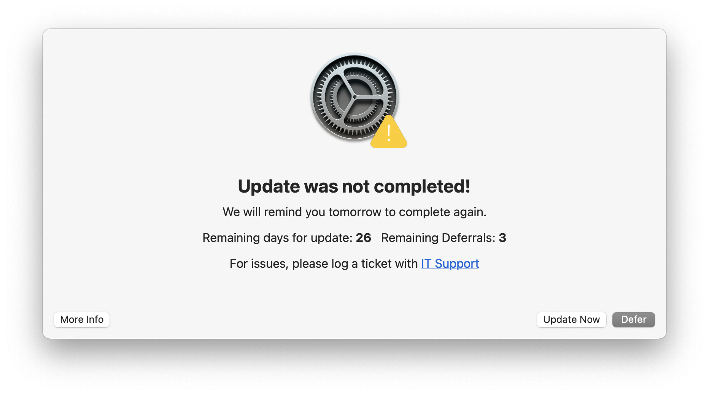

# nudge-swiftdialog

Nudge SwiftDialog is loosely based off of [Nudge](https://github.com/macadmins/nudge)

We cannot enforce the update to run, but we can nudge the user to do so. After a user clicks Update Device, the dialog closes and we :crossed_fingers: that they do it.

We can set a cut off date as well as the number of deferrals and a grace period for new machines.

This version can pull the configuration from CFPrefs, a control file, or will fall back to the defaults on the script.

## Update

## Update (No Deferrals Left)

When there are no deferrals left, the user will only have the option to update.

## Later

